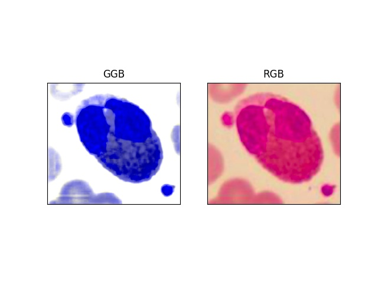
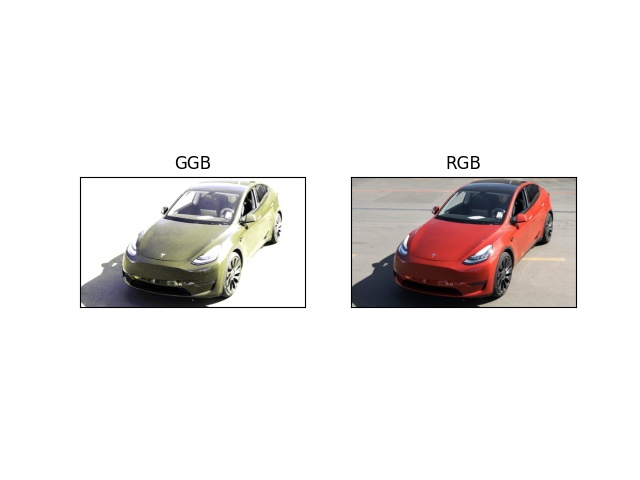

# GGB Color Space
This script is implementation of GGB color space from [Development of a Robust Algorithm for Detection of Nuclei and Classification of White Blood Cells in Peripheral Blood Smear Image](https://link.springer.com/content/pdf/10.1007%2Fs10916-018-0962-1.pdf)

## Dependencies
~~~
$ sudo pip install -r requirements.txt
~~~

## How to Use
~~~
$ python ggb.py --input <directory-to-your-image>
~~~

## Result

### Leukocytes

### Fundus

### Car

